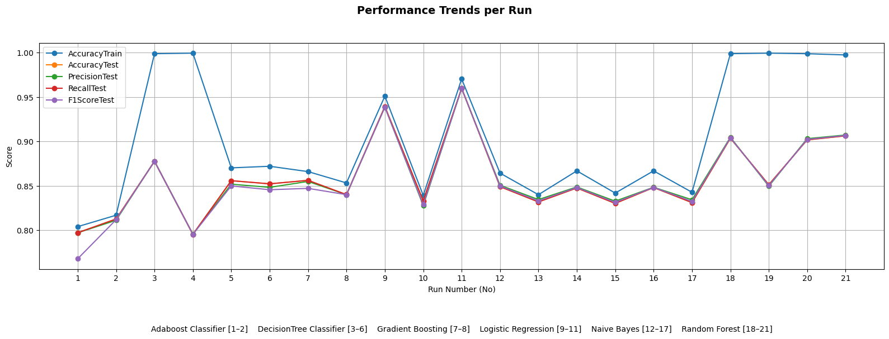
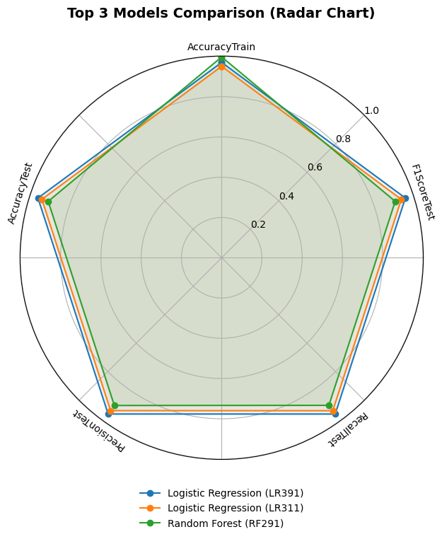

# 💬 Sentiment Analysis - Google Play Reviews

Analisis sentimen adalah bagian dari klasifikasi teks dalam pemrosesan bahasa alami (NLP) yang bertujuan mengidentifikasi dan mengevaluasi opini, sikap, atau emosi dalam suatu teks. Proses ini membantu menentukan apakah suatu pernyataan bernada positif, negatif, atau netral, dan dapat diterapkan untuk berbagai entitas seperti produk, layanan, individu, atau peristiwa. Di dunia bisnis, analisis sentimen sering digunakan untuk memahami suara pelanggan melalui ulasan, komentar media sosial, atau survei, yang kemudian digunakan untuk meningkatkan strategi pemasaran dan pengembangan produk.

---
Sentiment analysis is a subfield of text classification within natural language processing (NLP) that aims to identify and evaluate opinions, attitudes, or emotions expressed in a text. This process helps determine whether a statement carries a positive, negative, or neutral tone and can be applied to various entities such as products, services, individuals, or events. In the business world, sentiment analysis is often used to understand customer feedback from reviews, social media comments, or surveys, which in turn helps improve marketing strategies and product development.

 

## 🔬 **Google Play Reviews Sentiment Analysis Workflow**
✅ **Scraping** – Mengambil komentar pengguna dari Google Play Store  
✅ **Feature Extraction** – Membersihkan dan menyiapkan teks untuk analisis  
✅ **Machine Learning Model** – Menerapkan algoritma klasifikasi sentimen  
✅ **Model Comparison** – Membandingkan akurasi berbagai model  

 

## 📢 **Results**

### 📑 **Model Comparison Table**  

|    | Model Name           | IdRun | Accuracy Train | Accuracy Test | Precision Test | Recall Test | F1 Score Test |
|----|---------------------|-------|----------------|---------------|----------------|-------------|--------------|
| 1  | Adaboost Classifier | AD611 | 0.8041         | 0.7972        | 0.7972         | 0.7972      | 0.7679       |
| 2  | Adaboost Classifier | AD613 | 0.8170         | 0.8127        | 0.8113         | 0.8127      | 0.8119       |
| 3  | DecisionTree        | DT411 | 0.9990         | 0.8777        | 0.8778         | 0.8777      | 0.8777       |
| 4  | DecisionTree        | DT413 | 0.9996         | 0.7955        | 0.7955         | 0.7955      | 0.7955       |
| 5  | DecisionTree        | DT491 | 0.8703         | 0.8559        | 0.8519         | 0.8559      | 0.8500       |
| 6  | DecisionTree        | DT492 | 0.8721         | 0.8523        | 0.8484         | 0.8523      | 0.8457       |
| 7  | Gradient Boosting   | GB511 | 0.8661         | 0.8563        | 0.8550         | 0.8563      | 0.8472       |
| 8  | Gradient Boosting   | GB513 | 0.8533         | 0.8402        | 0.8401         | 0.8402      | 0.8401       |
| 9  | Logistic Regression | LR311 | 0.9511         | 0.9393        | 0.9388         | 0.9393      | 0.9386       |
| 10 | Logistic Regression | LR313 | 0.8393         | 0.8332        | 0.8278         | 0.8332      | 0.8289       |
| 11 | Logistic Regression | LR391 | 0.9705         | 0.9600        | 0.9598         | 0.9600      | 0.9598       |
| 12 | Naive Bayes         | NB11  | 0.8644         | 0.8492        | 0.8508         | 0.8492      | 0.8499       |
| 13 | Naive Bayes         | NB12  | 0.8401         | 0.8319        | 0.8346         | 0.8319      | 0.8331       |
| 14 | Naive Bayes         | NB13  | 0.8669         | 0.8477        | 0.8488         | 0.8477      | 0.8482       |
| 15 | Naive Bayes         | NB14  | 0.8419         | 0.8303        | 0.8328         | 0.8303      | 0.8314       |
| 16 | Naive Bayes         | NB21  | 0.8669         | 0.8482        | 0.8485         | 0.8482      | 0.8483       |
| 17 | Naive Bayes         | NB22  | 0.8428         | 0.8312        | 0.8344         | 0.8312      | 0.8326       |
| 18 | Random Forest       | RF211 | 0.9990         | 0.9037        | 0.9048         | 0.9037      | 0.9042       |
| 19 | Random Forest       | RF213 | 0.9996         | 0.8513        | 0.8496         | 0.8513      | 0.8503       |
| 20 | Random Forest       | RF221 | 0.9989         | 0.9019        | 0.9032         | 0.9019      | 0.9024       |
| 21 | Random Forest       | RF291 | 0.9975         | 0.9064        | 0.9073         | 0.9064      | 0.9068       |

 

### 📝 **Sentiment Distribution Chart** 

#### 📊 **Average Metrics per ModelType**

 

#### 📉 **Performance Trends per Run**

 

#### 🏆 **Top 3 Models Comparison (Radar Chart)** 

 

#### 🏆 **Top Runs Comparison (Radar Chart) per Model Name** 
